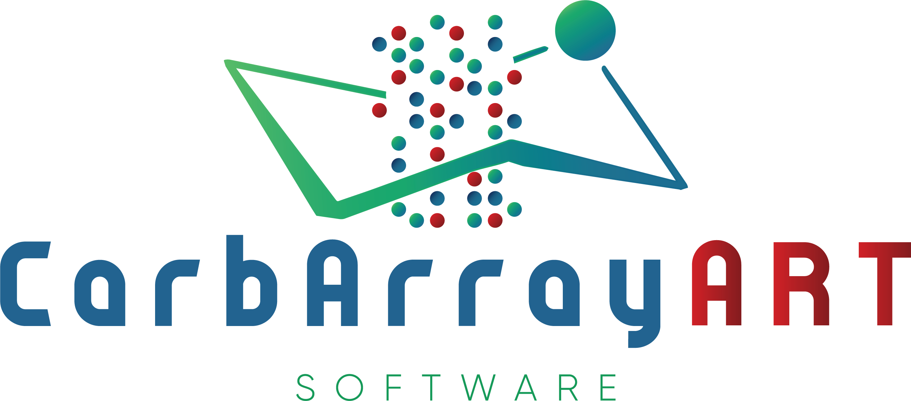
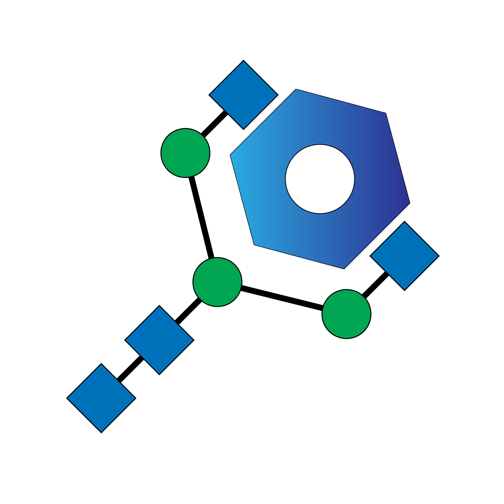
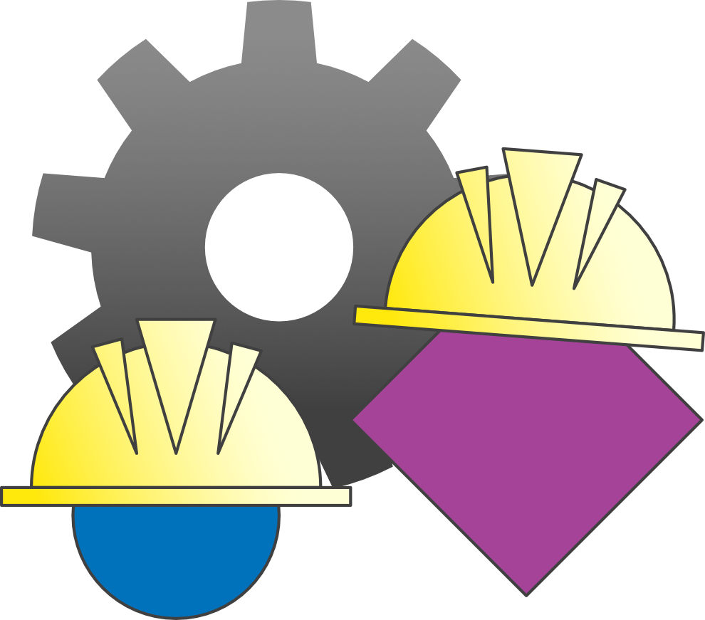

# GLIC Seminar Series
The aim of the GLIC seminar series is to introduce and promote software tools and databases to the bioinformatics and (glyco-)biology community. If you want to learn more about GLIC please visit our [home page](https://glic.glycoinfo.org/).

## Special Topic: Glycan Arrays
The GLIC webinar series on the special topic of glycan arrays will focus on tools and databases for processing, interpreting and storing glycan array data. The seminar series will start with an introduction to glycan arrays and how they can be used to study the interaction between glycans and other biological components, such as proteins, bio-fluids, lectins or micro-organism. In the following webinars individual groups will present their software tools and databases, and demonstrate their access and usage. All webinars will start at 10am ET.

## Organizers  
Rene Ranzinger and Akul Mehta

## Schedule  

| Date/Time | Presenter | Title | Resources |
| --- | --- | --- | --- |
| 02/06/2023 | Ren&#233; Ranzinger and Akul Mehta | [Introduction to glycan arrays](#introduction-to-glycan-arrays) | [Slides](20230206_Introduction_To_Glycan_Arrays.pdf)   [YouTube](https://www.youtube.com/watch?v=2r6qrnNzpRA) |
| 02/13/2023 | Yukie Akune | [CarbArrayART for glycan microarray data storage, presentation and reporting](#carbarrayart-for-glycan-microarray-data-storage-presentation-and-reporting) | [Slides](20230213_CarbArrayART.pdf)   [Software](https://glycosciences.med.ic.ac.uk/carbarrayart.html)   [YouTube](https://www.youtube.com/watch?v=rrlj28bAF5Y) |
| 02/27/2023 | Akul Mehta | [Using GLAD for exploratory glycan microarray data analysis and visualization](#using-glad-for-exploratory-glycan-microarray-data-analysis-and-visualization) |[Slides](20230227_GLAD_Introduction.pdf)   [Files](https://github.com/glycoinfo/GLIC/blob/master/seminars/glycan-arrays-2023/demo-files/GLAD%20Demo%20files.zip?raw=true)   [Software](https://glycotoolkit.com/GLAD/)   [YouTube](https://www.youtube.com/watch?v=Oh5j-X5kQa4) |
| 03/06/2023 | Zachary Klamer | [Using CarboGrove to guide experimental design and data interpretation](#using-carbogrove-to-guide-experimental-design-and-data-interpretation) |[Slides](20230306_CarboGrove.pdf)   [Software](https://carbogrove.org/)   [YouTube](https://www.youtube.com/watch?v=50jk_OCcER4) |
| 03/20/2023 | Ren&#233; Ranzinger | [The Glycan Array Data Repository](#the-glycan-array-data-repository) | [Slides](20230320_The_Glycan_Array_Data_Repository.pdf)   [Database](https://glygen.ccrc.uga.edu/ggarray/) |
| 03/27/2023 | Jon Lundstr&oslash;m | [LectinOracle@glycowork: Lectin binding predictions & glycan sequence analysis in Python](#lectinoracleglycowork-lectin-binding-predictions--glycan-sequence-analysis-in-python) | [Slides](20230327_LeOr_glycowork.pdf)   [Files](https://drive.google.com/drive/folders/1Ro_0VMC-uzEOimJbP9O785aCY3Qk36yS?usp=sharing)   [Software](https://bojarlab.github.io/glycowork/) |

 

 

## Details

### Introduction to glycan arrays
**Presenter**  
   
Ren&#233; Ranzinger1  and Akul Mehta2  
1Complex Carbohydrate Research Center  
University of Georgia  
Athens, GA, USA  

2National Center for Functional Glycomics  
Harvard Medical School  
Boston, MA, USA  

**Time**  
02/06/2023 10am ET

**Abstract**  
This first webinar will start with a short introduction into the webinar series and the individual talks. In this seminar we will provide a general overview about glycan array experiment and data processing and illustrate the use of this technique and data for the generation of new biological knowledge.

**Material**  
* [Slides](20230206_Introduction_To_Glycan_Arrays.pdf)
* [YouTube Recording](https://www.youtube.com/watch?v=2r6qrnNzpRA)
 

 

### CarbArrayART for glycan microarray data storage, presentation and reporting

**Presenter**  
  
Yukie Akune  
Department of Metabolism, Digestion and Reproduction  
Imperial College London  
London, UK  

**Time**  
02/13/2023 10am ET

**Abstract**  
CarbArrayART (Carbohydrate microArray Analysis and Reporting Tool) is a software tool for day to day use for: (1) Recording scan data and related metadata. (2) Processing and presentation of data as tables and charts with filtering and sorting functions and (3) Reporting data compliant with MIRAGE guidelines.

**Material**  
* [Slides](20230213_CarbArrayART.pdf) 
* [CarbArrayART Homepage](https://glycosciences.med.ic.ac.uk/carbarrayart.html) 
* [YouTube Recording](https://www.youtube.com/watch?v=rrlj28bAF5Y)
 

 

### Using GLAD for exploratory glycan microarray data analysis and visualization

**Presenter**  
  
Akul Mehta  
National Center for Functional Glycomics  
Harvard Medical School  
Boston, MA, USA

**Time**  
02/27/2023 10am ET

**Abstract**  
GLAD is a useful tool to explore data from several glycan microarray experiments. GLAD allows you to visualize your data and compare datasets using several visualization options. It also allows for basic data wrangling such as filtering and sorting your data.

**Material**  
* [Slides](20230227_GLAD_Introduction.pdf)
* [GLAD Homepage](https://glycotoolkit.com/GLAD/)
* [Demo Files](https://github.com/glycoinfo/GLIC/blob/master/seminars/glycan-arrays-2023/demo-files/GLAD%20Demo%20files.zip?raw=true) 
* [YouTube Recording](https://www.youtube.com/watch?v=Oh5j-X5kQa4)
 

 

### Using CarboGrove to guide experimental design and data interpretation
  

**Presenter**  
  
Zachary Klamer (zachary.klamer@vai.org)  
Van Andel Research Institute  
Grand Rapids, MI, USA  

**Time**  
03/06/2023 10am ET

**Abstract**  
Lectins and Glycan Binding Proteins are powerful and accessible tools for glycan analysis. Despite the abundance of datasets providing glycan-binding profiles of GBPs, researchers frequently interpret GBP binding using inaccurate or incomplete definitions of GBP specificity. Here we present CarboGrove, a database of data-driven and human-readable glycan binding specificities derived from 36 different glycan array platforms for hundreds of glycan binding proteins. To enable users to readily access the binding information, the database features many options for searching and filtering the results including the ability to search by affinity to various motifs. Furthermore, glycan-binding models can be downloaded and used for the prediction of GBP to new glycans, a crucial step in experimental design and the automated interpretation of glycan binding data.

**Material**  
* [Slides](20230306_CarboGrove.pdf)
* [CarboGrove webpage](https://carbogrove.org/) 
* [YouTube Recording](https://www.youtube.com/watch?v=50jk_OCcER4)
 

 

### The Glycan Array Data Repository
**Presenter**  
  
Ren&#233; Ranzinger  
Complex Carbohydrate Research Center  
University of Georgia  
Athens, GA, USA  

**Time**  
03/20/2023 10am ET

**Abstract**  
The Glycan Array Data Repository is a online database for storing and sharing glycan array data. Every group or individual can create a account and submit their data including the MIRAGE compliant metadata. Users can freely search and access the sbumitted dataset.

**Material**  
* [Slides](20230320_The_Glycan_Array_Data_Repository.pdf)
* [Glycan Array data repository (Beta) - Test system](https://glygen.ccrc.uga.edu/ggarray/)
* [Glycan Array data repository - Production system](https://glygen.ccrc.uga.edu/array/)
* YouTube Recording
 

 

### LectinOracle@glycowork: Lectin binding predictions & glycan sequence analysis in Python
  

**Presenter**  
  
Jon Lundstr&oslash;m  
Department of Chemistry and Molecular Biology and Wallenberg Centre for Molecular and Translational Medicine  
University of Gothenburg  
Gothenburg, Sweden  

**Time**  
03/27/2023 10am ET

**Abstract**  
LectinOracle is a deep learning model for generalizable lectin-glycan binding predictions. Here, we demonstrate LectinOracle and showcase its use within glycowork, our Python package for glycan sequence processing & analysis, including interpretation of the results.

**Material**  
* [Slides](20230327_LeOr_glycowork.pdf)
* [GlycoWork Homepage](https://bojarlab.github.io/glycowork/)
* [Demo Files](https://drive.google.com/drive/folders/1Ro_0VMC-uzEOimJbP9O785aCY3Qk36yS?usp=sharing) 
* YouTube Recording
